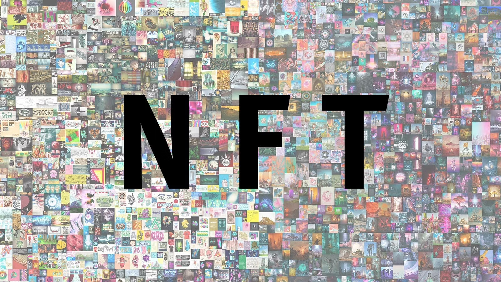

# 💎 What is an NFT?

<mark style="background-color:orange;">**An NFT is a digital asset representing real-world objects like art, music, in-game items and videos. They are bought and sold online, frequently with cryptocurrency, and they are generally encoded with the same underlying software as many cryptos.**</mark>

### What is NFT Used For? 

People interested in Crypto-trading and people who like to collect artwork often use NFTs. Other than that, it has some other uses too like:

* Digital Content - The most significant use of NFTs today is in digital content. Content creators see their profits enhanced by NFTs, as they power a creator economy where creators have the ownership of their content over to the platforms they use to publicize it.\

* Gaming Items - NFTs have garnered considerable interest from game developers. NFTs can provide a lot of benefits to the players. Normally, in an online game, you can buy items for your character, but that’s as far as it goes. With NFTs, you can recoup your money by selling the items once you’re finished with them.\

* Investment and Collaterals - Both NFT and DeFi (Decentralized Finance) share the same infrastructure. DeFi applications let you borrow money by using collateral. NFT and DeFi both work together to explore using NFTs as collateral instead.

* Domain Names - NFTs provide your domain with an easier-to-remember name. This works like a website domain name, making its IP address more memorable and valuable, usually based on length and relevance.

**Read more about NFTs, right here** [https://www.forbes.com/advisor/in/investing/what-is-an-nft-how-do-nfts-work/](https://www.forbes.com/advisor/in/investing/what-is-an-nft-how-do-nfts-work/)&#x20;

\
\
